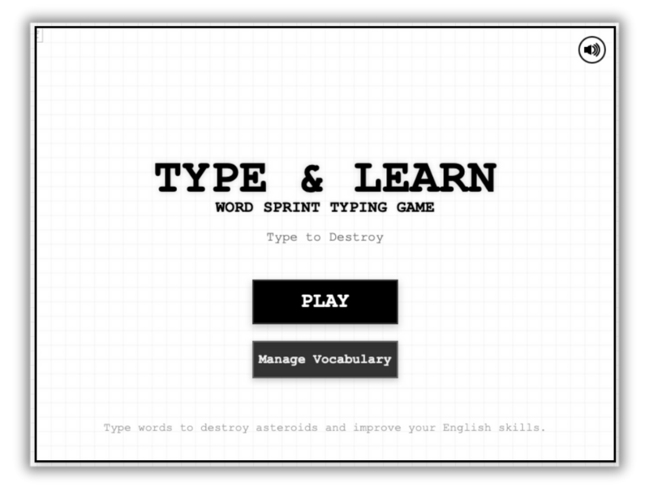

# Type & Learn

> A browser-based typing game where players destroy asteroids by typing English words, featuring English-Thai vocabulary learning.

[](https://iylmwysst.github.io/typeandlearn/)
[](LICENSE)
[](https://paypal.me/iylmwysst)

<p align="center">
  
</p>

## 🎮 About

Type & Learn is an educational typing game inspired by ZType. Players defend their ship by typing English words to destroy incoming asteroids, while learning English-Thai vocabulary through gameplay.

**Note**: This project is not affiliated with or endorsed by ZType or its developers.

## ✨ Features

- 🎯 **Progressive Difficulty** - Dynamic scaling based on player performance
- 📚 **Vocabulary Learning** - English-Thai word pairs with translation display
- 🎨 **Theme Support** - Dark/light mode toggle
- 🏆 **Tiered Enemy System** - NORMAL, RARE, and ELITE asteroids with unique behaviors
- 🚀 **Smart Bullet System** - Range-based firing with homing capabilities
- ⚡ **Special Powers** - Gauge system and multi-target attacks
- 🔊 **Sound Effects** - Audio feedback for actions
- 📊 **Progress Tracking** - Word appearance statistics

## 🚀 Getting Started

### Prerequisites

None! This is a static web application with no dependencies.

### Running Locally

1. Clone the repository:
   ```bash
   git clone https://github.com/yourusername/typeandlearn.git
   cd typeandlearn
   ```

2. Open in browser:
   - **Option 1**: Open `index.html` directly in your browser
   - **Option 2**: Use a local server:
     ```bash
     python3 -m http.server 8000
     # OR
     npx serve
     ```
   - Access at `http://localhost:8000`

## 🎮 How to Play

1. **Type to Target** - Type the first letter of a word to target the nearest matching asteroid
2. **Complete Words** - Finish typing the word to destroy the asteroid
3. **Learn Vocabulary** - View English-Thai translations in the side panel
4. **Quick Snap** - Hold SPACEBAR to see recent translations
5. **Special Power** - Press ENTER to attack all enemies in range (requires power gauge)
6. **Survive** - Don't let asteroids reach your ship!

## 🛠️ Technology Stack

- **Frontend**: Vanilla JavaScript, HTML5 Canvas
- **Styling**: CSS3 with theme support
- **Data**: CSV-based vocabulary lists
- **Architecture**: Client-side single-page application

## 📁 Project Structure

```
typeandlearn/
├── assets/
│   ├── data/           # Vocabulary CSV files
│   ├── images/         # Game images and logos
│   └── sound/          # Audio files (All Rights Reserved)
├── css/
│   └── style.css       # Main stylesheet
├── js/
│   ├── game.js         # Main game controller
│   ├── ship.js         # Player ship entity
│   ├── asteroid.js     # Enemy entity system
│   ├── bullet.js       # Projectile system
│   ├── wordbank.js     # Word management
│   ├── vocabulary.js   # Translation system
│   ├── sound.js        # Audio system
│   └── utils.js        # Helper functions
├── index.html          # Entry point
├── LICENSE             # MIT License for code
└── ASSETS-LICENSE      # All Rights Reserved for assets
```

## 📝 Adding Custom Vocabulary

1. Create or edit CSV file in `assets/data/`
2. Format: `english_word,thai_translation`
3. Use the in-game file import or replace the default vocabulary file
4. Reload the game

Example CSV:
```csv
word,thai
cat,แมว
dog,สุนัข
hello,สวัสดี
```

## 🎨 Customization

- **Theme**: Toggle dark/light mode in-game or modify CSS
- **Difficulty**: Adjust scaling in `game.js`
- **Enemy Types**: Edit `ENEMY_TIERS` in `asteroid.js`
- **Vocabulary**: Import custom CSV files

## 📜 License

- **Code**: [MIT License](LICENSE) - Free to use, modify, and distribute
- **Assets**: [All Rights Reserved](ASSETS-LICENSE) - Images, sounds, and media files require permission

See individual license files for details.

## 🙏 Acknowledgments

- Inspired by [ZType](https://zty.pe/)
- Created by [iylmwysst](https://github.com/iylmwysst)

## 🐛 Issues & Contributions

Found a bug or have a feature request? Please open an issue on GitHub.

Contributions are welcome! Please feel free to submit a Pull Request.

## 📧 Contact

For asset usage permissions or other inquiries, please contact: iylmwysst

---

Made with ❤️ for language learners
